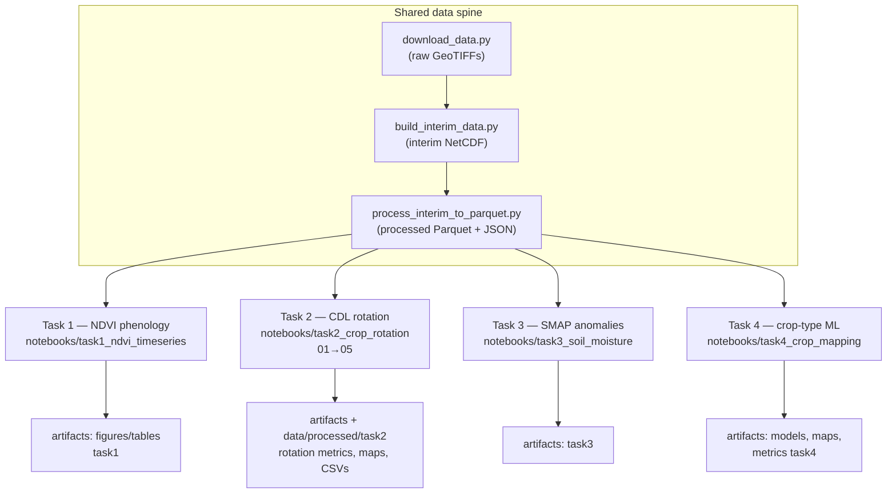

# PROJECT_BRIEF.md

## What We Are Building

A reproducible, end-to-end geospatial analysis and machine learning pipeline
for the CropSmart NAFSI Track 1 challenge. The pipeline integrates three
operational datasets — CDL, MODIS NDVI, and SMAP — to characterize crop
phenology, detect rotation patterns, quantify soil moisture anomalies, and
predict crop types across the Contiguous United States.

## Four Tasks

| Task | Goal | Primary Dataset |
|------|------|----------------|
| 1 | NDVI phenological comparison: corn vs. soybean (Corn Belt) | MODIS NDVI + CDL |
| 2 | Crop rotation pattern identification over 10-year CDL series | CDL (2015–2024) |
| 3 | Soil moisture anomaly maps relative to multi-year baseline | SMAP L4 + CDL |
| 4 | Spatially generalizable crop-type classification model | CDL + NDVI + SMAP |

## Success Criteria

- All four tasks complete and fully reproducible (notebooks run top-to-bottom)
- Evaluation metrics reported: F1, OA, confusion matrix (Task 4)
- All six report questions answered clearly
- Artifact index fully populated in `structure.md`
- GitHub repository frozen before April 13, 2026 — 4:00 PM CT

## Constraints

- No AI-generated prose in the PDF report
- All supplementary datasets must be publicly accessible and documented
- Repository must include: notebooks, requirements.txt, README.md, PDF report
- Evaluation rubric: Analytical Accuracy 35%, Methodology/Reproducibility 30%, Innovation 20%, Communication 15%

## Where data lives in this repo

Large rasters are usually gitignored. The working layout is: **raw GeoTIFFs** under `data/raw/{cdl,ndvi,smap}/`, **interim NetCDF stacks** under `data/interim/{cdl,ndvi,smap}/`, and **ML-oriented wide Parquet** (plus JSON sidecars) under `data/processed/{cdl,ndvi,smap}/`. Scripts `download_data.py`, `build_interim_data.py`, and `process_interim_to_parquet.py` implement that flow; details are in `README.md`, `context/structure.md`, and `context/DATASETS.md` §5–**§5.1** (which YAML controls the **13-state Corn Belt** bbox vs Task 2 labeling).

---

## End-to-end pipeline and task structure

The repo is organized as **one shared data spine** (CDL, NDVI, SMAP) and **four analysis tracks** (Tasks 1–4). Each task reads **processed** (and sometimes interim) artifacts, writes **config-driven** outputs under `artifacts/` and/or `data/processed/`, and is implemented primarily as **ordered Jupyter notebooks** plus `src/` modules and `scripts/` CLIs.

### Workflow (high level)

**Execution order for a cold start (typical):** (1) download and build interim stacks for the datasets you need; (2) run `process_interim_to_parquet.py` for CDL (required for Task 2), and for NDVI/SMAP as needed for Tasks 1, 3, and 4; (3) run each task’s notebooks in folder order (Task 2: **01 → 05**). Exact commands and paths are in `README.md`, `context/structure.md`, `context/INTERFACES.md`, and `context/TASK2_NAFSI_DATA_CONTRACT.md`.

### NAFSI-style research expectations vs tasks (mapping)

The Track 1 brief and common judging criteria mix **several distinct problems**. The table below states **where each expectation is addressed** in this repository. Items marked **Task 4** are part of the project plan but **not** implemented by the rotation-only track.

| Expectation (summary) | Primary task | Where documented / produced |
|------------------------|--------------|-----------------------------|
| Full pipeline description, reproducibility, diagrams | All | This section; `context/structure.md`; `context/INTERFACES.md`; `context/TASK2_NAFSI_DATA_CONTRACT.md` |
| **Supervised ML** crop-type model (corn, soy, + other), multi-year CDL as features **and** labels; optional NDVI/SMAP | **Task 4** | Planned: `notebooks/task4_crop_mapping/`, `src/modeling/`; metrics: OA, per-class F1, confusion matrix — see `context/STATUS.md` |
| Feature matrix from CDL temporal/spatial structure (+ optional NDVI/SMAP aggregates) | **Task 4** (features); **Task 2** uses CDL **sequences** for **rule-based rotation metrics**, not a sklearn/LightGBM classifier | Task 4: `INTERFACES.md` (`build_feature_matrix`); Task 2: `context/TASK2_RESULTS.md`, `src/` rotation metrics |
| Train on past years, validate on held-out year(s) | **Task 4** | Not applicable to Task 2’s fixed 2015–2024 rotation window (descriptive / rule-based, not year-held-out classification) |
| Feature **importance** / ablation (CDL-only vs +NDVI vs +SMAP) | **Task 4** | Task 2 does **not** train a model; see `context/STATUS.md` pending Task 4 |
| **Rotation** pattern identification, Markov/sensitivity, maps of rotation **classes** | **Task 2** | `notebooks/task2_crop_rotation/`, `context/TASK2_RESULTS.md`, `artifacts/figures/task2/`, `artifacts/tables/task2/` (Markov/sensitivity), **`artifacts/tables/task4/`** (NB05 areal CSV/JSON for Task 4 bridge) |
| Phenology / NDVI vs CDL | **Task 1** | `notebooks/task1_ndvi_timeseries/` |
| Soil moisture anomalies vs baseline | **Task 3** | `notebooks/task3_soil_moisture/` |

**Visualizations and metrics for judges:** Task 2 supplies **diagnostic and thematic figures** (histograms, Markov, sensitivity, rotation maps) and **tabular metrics** (Markov CSVs, threshold grid, areal stats with metadata JSON). Supervised **classification accuracy** tables for a held-out crop year are **Task 4** deliverables once the model notebook is complete.
