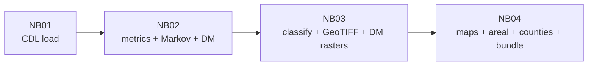

# Task 2 — Results and interpretation (crop rotation from CDL)

**Last updated:** 2026-04-12  
**Submission context:** NAFSI Track 1 deadline **2026-04-13 4:00 PM CT** — rule-based class shares and Markov structure match the **2026-04-11** reference run; **2026-04-12** full re-run adds **Bayesian Dirichlet–Multinomial** columns, float GeoTIFFs, and figures dated **`20260412`** under `artifacts/figures/task2/` and `artifacts/tables/task4/`.  
**Analysis window:** CDL years **2015–2024** (10 years, inclusive), processed wide Parquet + spatial metadata from `data/processed/cdl/`.  
**Pipeline:** Notebooks **01→04** in `notebooks/task2_crop_rotation/` (merged **04** = maps + areal + county + run bundle). Prefer `jupyter nbconvert --execute` or run cells top-to-bottom.

---

## 0. Executive summary (diagnostic read)

**Data run:** **13-state Corn Belt** (IL, IN, IA, KS, KY, MI, MN, MO, NE, ND, OH, SD, WI) | **2,084,112** rotation-eligible pixels (corn or soy in **≥5** of 10 years, YAML `rotation_eligibility.min_cornsoy_years_for_metrics`). Grid resolution: **`approx_grid_resolution_m` ≈ 556.7** and **`pixel_area_ha` ≈ 30.9876** in `artifacts/tables/task4/task2__areal_stats_by_class__20260412__metadata.json` (often summarized as **~557 m** and **~31 ha** per cell).

1. **Denominator.** All NB02–NB04 tables use this **eligible** pool (not CONUS, not native 30 m field census).

2. **Strict primary classification (YAML).** `classify_batch` assigns **0 = regular**, **1 = monoculture**, **2 = irregular**. On the **raw** class GeoTIFF, the 2026-04-11 run is about **28% / 6% / 66%** (regular / monoculture / irregular), matching the **(0.70, 3)** column of the sensitivity pivot (~**28.15%** regular). The **smoothed** GeoTIFF (3×3 majority) is the preferred **map and areal** headline for the report: **27.36%** regular, **3.90%** monoculture, **68.74%** irregular (**2,084,112** valid cells). Smoothing **relabels edge pixels**; it does not invert the class legend.

3. **Threshold sensitivity.** `pct_monoculture` is **constant across all 20** `(alternation_min, pattern_dist_max)` rows (orthogonality). Example pivot from the same run: **~60%** regular at **(0.50, 6)** vs **~28%** at strict **(0.70, 3)**. Cite the saved `task2__threshold_sensitivity_grid.csv` after each re-run.

4. **Markov (corn / soy / other).** Empirical **P(to | from)** across eligible pixel-years (full **13-state** 2026-04-11 run) are in `artifacts/tables/task2/task2__markov_transition_probs.csv`. Headline transitions: **corn→soy ≈ 0.55**, **soy→corn ≈ 0.60**; **P(other→other) ≈ 0.36** is the largest self-loop in the **other** row — together with **other→corn** and **other→soy**, “other” years break strict alternation templates and support a **large irregular** class under the primary rules. Re-read the CSV after each footprint or year-window change.

5. **Geography.** Notebook **04** **per-state** table is the lead communication product (**Illinois** and **Iowa** ~**40%** strict regular on eligible pixels; **Nebraska** highest **% monoculture** ~**12%**; **North Dakota** highest **% irregular** ~**86%** — see §2.6). The same notebook adds **four** illustrative map callouts on the class maps (eastern core, Plains monoculture, northern fringe, east–west gradient); they are **pedagogical**, not zonal statistics. Figure **`artifacts/figures/task2/task2__per_state_rotation_classes.png`** is produced in notebook **04**. **Rotation-class map legends** use **`loc="upper right"`** in `plot_rotation_class_map` (`src/viz/rotation_maps.py`) so callouts in the lower map corners stay readable.

6. **Bayesian DM (2026-04-12 run).** On all **2,084,112** eligible pixels with `bayesian_dm.enabled`, **`dm_p_regular`** (Monte Carlo fraction of draws where the posterior alternation proxy ≥ YAML `regular_alt_proxy_min`) has **mean ≈ 0.23**, **median ≈ 0.11**, **IQR ≈ [0.02, 0.38]**; **~17.2%** of pixels exceed **0.5** posterior probability. **`dm_alt_posterior_std`** (epistemic spread of the proxy across draws) has **median ≈ 0.134**. **Interpretation:** many pixels get **low** P(regular) because the Dirichlet draws reflect **sparse or noisy** corn/soy transition counts, not because the rule-based class is always “irregular” — see §2.7. Maps: `artifacts/figures/task2/task2__rotation_dm_p_regular__20260412.png`, `task2__rotation_dm_alt_posterior_std__20260412.png`.

**NAFSI rotation bullets (coverage snapshot):** (1) **Quantitative criterion** — fully covered by YAML + NB02–03 + sensitivity grid (rule-based) plus **Bayesian Dirichlet–Multinomial** `dm_*` columns in `rotation_metrics.parquet` (NB02, `bayesian_dm` in YAML). (2) **Spatial distribution** — GeoTIFF + state-boundary maps (`task2__rotation_map__*__YYYYMMDD.png`) plus **core-belt zoom** (`task2__rotation_map__core_belt__YYYYMMDD.png`, notebook **04**); DM surfaces `task2__rotation_dm_*__*.png` from notebook **04** (float GeoTIFFs from NB03). (3) **Area proportions** — §2.3 + per-state CSV. (4) **Association with counties / water / soil** — **county-level** CSV + choropleth from notebook **04** (`task2__areal_stats_by_county__*.csv`, `task2__rotation_class_by_county__*.png`) when TIGER cache is available; **NHD** / **SSURGO** still out of scope (see §2.9).

---

## 1. What we measured

| Metric | Meaning |
|--------|---------|
| **alternation_score** | Share of adjacent-year transitions that are corn↔soy when both years are corn or soy. |
| **max_run_length** | Longest run of the same CDL code. |
| **pattern_edit_distance** | Minimum Hamming distance to a strict 10-yr corn–soy alternation template (corn-first or soy-first). |
| **entropy** | Shannon entropy (bits) of the 10-year CDL code sequence at the pixel. |
| **n_cornsoy_years** | Count of years in {corn, soy}. |
| **crop_share** | Fraction of years equal to the modal crop code. |
| **dm_p_regular** | Posterior probability that the **Bayesian** alternation proxy (mean of sampled P(corn→soy) and P(soy→corn) under independent Dirichlet rows) exceeds `regular_alt_proxy_min` — see `src/modeling/rotation_bayesian_dm.py`. |
| **dm_alt_posterior_std** | Posterior standard deviation of that proxy across Monte Carlo draws (high = epistemic uncertainty). |
| **dm_n_trans_origin_corn_soy** | Count of year-to-year edges whose **from** state is corn or soy (denominator for how informative the DM row posteriors are). |

**Denominators**

1. **Ever corn/soy** — used in NB02 for the **`n_cornsoy_years` histogram** before filtering (count updates with stack extent).  
2. **Rotation-eligible** — ≥**5** years as corn or soy (**n = 2,084,112** on the 2026-04-11 13-state run): rows in `rotation_metrics.parquet`, classification, sensitivity, Markov, and notebook **04** areal exports.

**Classification rules** (`configs/task2_crop_rotation.yaml`)

- **Regular rotation (0):** alternation ≥ 0.70, pattern distance ≤ 3, corn/soy years ≥ 7, and **not** monoculture.  
- **Monoculture (1):** max run ≥ 7 **or** crop_share ≥ 0.80.  
- **Irregular (2):** all other **eligible** pixels.

---

## 2. Numeric results (13-state run; rule-based shares stable 2026-04-11 → 2026-04-12)

### 2.0 Raw vs smoothed — there is no 40-point “class swap” bug

Notebook 03 previously printed `value_counts(normalize=True).to_dict()`, which shows **numeric keys** (`0.0`, `1.0`, `2.0`) **unsorted**. **Always map keys by code:** **0 → regular**, **1 → monoculture**, **2 → irregular** (`rotation_classifier.classify_batch`). Misreading `{2.0: 0.66, ...}` as “66% regular” caused a false alarm; **66% is irregular**. NB03 cell output is now **explicitly labeled**; notebook **04** uses the same legend (**upper right** in code).

### 2.1 Metric summaries — rotation-eligible (`rotation_metrics.parquet`, n = 2,084,112)

Re-run NB02 after large stack changes and paste refreshed means/medians here. Qualitatively, eligible pixels remain **corn/soy heavy** with **median alternation 0.5** and **pattern distance** mass **above** the strict **≤3** cutoff — so **strict regular** stays a **minority** class.

### 2.2 Class distribution — primary YAML (matches raw GeoTIFF, before spatial smoothing)

| Class | Code | Share of **eligible** pixels (approx.; verified **2026-04-12** export) |
|-------|------|--------------------------------|
| Regular rotation | 0 | **~28%** |
| Monoculture | 1 | **~6%** |
| Irregular | 2 | **~66%** |

(`rotation_metrics_classified.parquet` column `rotation_class` uses the same coding.)

### 2.3 Areal summary — **smoothed** GeoTIFF (notebook 04; authoritative for report headline)

Use the dated `artifacts/tables/task4/task2__areal_stats_by_class__YYYYMMDD.csv` next to its `*__metadata.json` for **pixel_area_ha** and CRS. **2026-04-12** export (`task2__areal_stats_by_class__20260412.csv` / `*__metadata.json`) — **same** rule-based percentages as the 2026-04-11 headline:

| Class | Pixel count | Area (10³ ha) | % of valid cells |
|-------|-------------|----------------|------------------|
| regular_rotation | 570,202 | ~17,669 | **27.36%** |
| monoculture | 81,308 | ~2,520 | **3.90%** |
| irregular | 1,432,602 | ~44,393 | **68.74%** |
| **Total** | **2,084,112** | **~64,582** | 100% |

### 2.4 Markov transitions — corn / soy / other

Row = **from** (year t), column = **to** (year t+1). Values are **empirical P(to | from)** across all eligible pixel-years in `artifacts/tables/task2/task2__markov_transition_probs.csv`. Matrix below matches the **2026-04-12** re-read of that file (rounded; same as prior 13-state run):

| from \\ to | corn | soy | other |
|------------|------|-----|-------|
| **corn** | 0.308 | 0.554 | 0.138 |
| **soy** | 0.600 | 0.238 | 0.162 |
| **other** | 0.339 | 0.300 | **0.361** |

**Re-open the CSV after each full re-run** — transition mass shifts with study extent and year window.

### 2.5 Threshold sensitivity (excerpt — full grid in CSV)

Same **2,084,112** pixels; only **alternation_min** and **pattern_dist_max** vary; **`cs_min` = 7** and monoculture rule unchanged. **Monoculture % is identical on every row** (see CSV). Example from the notebook pivot (`% regular` of eligible; unchanged on **2026-04-12** re-run):

| alternation_min | pattern_dist_max | % regular |
|-----------------|------------------|-----------|
| 0.70 | 3 | **28.15** |
| 0.70 | 6 | **39.37** |
| 0.50 | 5 | **56.58** |
| 0.50 | 6 | **60.33** |

**Figure:** `artifacts/figures/task2/task2__threshold_sensitivity_regular_pct.png`.

### 2.6 Per-state table (Notebook 04, **raw** class labels on **eligible** pixels)

Values below are from **`artifacts/tables/task4/task2__areal_stats_by_region__20260412.csv`** when **state boundaries load** (Natural Earth or `data/external/states/*.shp`). If notebook **04** falls back to a single region, the CSV may contain only **`full_raster_extent`** — re-run notebook **04** with boundaries available for the full table.

| State | n_pixels | % regular | % monoculture | % irregular |
|-------|----------|-----------|----------------|---------------|
| Illinois | 293,524 | 40.35 | 5.07 | 54.58 |
| Indiana | 156,899 | 34.29 | 4.23 | 61.48 |
| Iowa | 321,601 | 39.87 | 6.93 | 53.20 |
| Kansas | 108,705 | 14.24 | 8.11 | 77.65 |
| Kentucky | 38,066 | 20.54 | 3.88 | 75.57 |
| Michigan | 66,989 | 12.59 | 3.92 | 83.49 |
| Minnesota | 223,678 | 31.31 | 3.26 | 65.43 |
| Missouri | 120,804 | 23.12 | 7.24 | 69.64 |
| Nebraska | 212,194 | 27.13 | **11.96** | 60.91 |
| North Dakota | 118,282 | 11.29 | 2.81 | **85.90** |
| Ohio | 120,718 | 22.85 | 5.69 | 71.46 |
| South Dakota | 154,733 | 28.17 | 1.46 | 70.37 |
| Wisconsin | 81,812 | 13.55 | 5.45 | 81.00 |
| outside_configured_states | 66,107 | 5.10 | 16.47 | 78.43 |

**Figure:** `artifacts/figures/task2/task2__per_state_rotation_classes.png` (stacked horizontal bars, notebook 04).

### 2.7 Bayesian Dirichlet–Multinomial posteriors (`dm_*`, **2026-04-12** run)

**Implementation:** `configs/task2_crop_rotation.yaml` → `bayesian_dm` (default **Jeffreys** 0.5 pseudo-counts per transition category, **256** Monte Carlo draws per pixel in chunks). **NB02** appends **`dm_p_regular`**, **`dm_alt_posterior_std`**, **`dm_n_trans_origin_corn_soy`** to `rotation_metrics.parquet`. **NB03** burns **`rotation_dm_p_regular.tif`** and **`rotation_dm_alt_posterior_std.tif`** (float32, nodata **−9999** outside eligible / non-finite). **Notebook 04** renders:

| Artifact | Role |
|----------|------|
| `artifacts/figures/task2/task2__rotation_dm_p_regular__20260412.png` | **Spatial map of posterior P(regular)** — warmer colors = higher probability that the **Bayesian** alternation proxy exceeds the YAML threshold (default **0.70**, same *scale* as the empirical alternation score, not a sum of two probabilities to 1.4). |
| `artifacts/figures/task2/task2__rotation_dm_alt_posterior_std__20260412.png` | **Epistemic uncertainty** of that proxy: high values often sit where **few** corn/soy-originating transitions were observed, so the Dirichlet posterior for the corn row / soy row is **diffuse** even if the **rule-based** label is a hard 0/1/2. |

**How to read P(regular) vs the 3-class map**

- The **class map** answers: “Does this pixel’s *observed* 10-year CDL sequence satisfy the **intersection** of fixed rules (alternation, Hamming distance, corn/soy count, monoculture screen)?” — **binary** outcome per rule block.
- **`dm_p_regular`** answers: “Given only the **3×3 transition counts** (corn/soy/other) implied by that sequence, what fraction of **posterior draws** of P(corn→soy) and P(soy→corn) produce an **alternation proxy** ≥ threshold?” — a **probability on [0, 1]**, not the same as “probability the pixel is class 0.” A pixel can be **irregular** under rules (e.g. high `other` turnover) yet show **moderate** P(regular) if the **corn↔soy edges** that exist look alternated in small samples, or **low** P(regular) if even the corn/soy rows look non-alternating under posterior uncertainty.
- **Aggregate (2026-04-12, all finite):** mean **dm_p_regular ≈ 0.23**, median **≈ 0.11**, **~17%** of pixels **> 0.5** — lower than the **~28%** strict regular *share* because the DM layer only “votes” on the **Markov-style** alternation channel, not pattern distance or monoculture screens.

**Literature hook:** Bayesian estimation of **transition probabilities** (e.g. Dirichlet–multinomial / Markov chain priors) is standard in health and ecology; cite **Welton & Ades (2005)** and related **Bayesian Markov** work when contrasting this layer to the **deterministic** `classify_batch` map.

### 2.8 Novel findings (report hooks)

| ID | Takeaway |
|----|-----------|
| **A** | **Illinois vs Iowa** neck-and-neck on **% strict regular** (~0.5 pp); **Nebraska** highest **% monoculture** — consistent with **irrigated continuous corn** vs **rain-fed rotation** framing (Q5). |
| **B** | **Northern / Lakes states** (e.g. ND, WI, MI) show very high **% irregular** — agronomically expected (more small grains, hay, other); including them shows the **rule set is geography-sensitive**, not a bug (Q3). |
| **C** | **Monoculture concentration (region table):** among eligible pixels classified as monoculture, **Nebraska ≈ 20.2%** and **Iowa ≈ 17.7%** of the Belt total monoculture **pixel count** (jointly **~38%**); see `task2__areal_stats_by_region__20260412.csv` (product `n_pixels × pct_monoculture/100`, summed over states). |
| **D** | **Markov structure is extent-dependent** — always cite the dated `task2__markov_transition_probs.csv` when comparing a **narrow bbox** to the **full 13-state** run (Q3). |
| **E** | **P(other→other) ≈ 0.36** (§2.4) plus **other→corn/soy** mass explains how **CDL “other” years** break ideal alternation and inflate **irregular** under strict templates (Q4). |
| **F** | **Orthogonality:** monoculture % **flat** across the 20 sensitivity rows — **persistence axis** vs **template-match axis** (Q3). |
| **G** | **Bayesian DM layer:** **mean P(regular) ≈ 0.23** vs **~28%** strict regular (rules) — the DM answers a **narrower** question (transition-based alternation uncertainty); pair **§2.7** figures with class maps in the report to show **probabilistic** vs **threshold** views (Innovation / Methods narrative). |

### 2.9 NAFSI “spatial association” bullet — what is done vs optional

| Rubric ask | Current evidence | Efficient next step (no large downloads) |
|------------|-------------------|----------------------------------------|
| **County boundaries** | **Notebook 04** (cell “County-level shares”): `load_cornbelt_counties_5070` caches Census **TIGER** under `data/external/tiger/`, assigns each **eligible** pixel to a county, reads **smoothed** class at `(iy, ix)` → **13-state** `task2__areal_stats_by_county__*.csv` + `task2__rotation_class_by_county__*.png`, plus **core four states** (IL, IN, IA, NE) `task2__areal_stats_by_county_core4__*.csv` + `task2__rotation_class_by_county_core4__*.png` (many counties per state). |
| **Proximity to water** | Not computed | **Qualitative** report text only for deadline (e.g. irrigation corridors vs rain-fed core), or defer **NHD** (heavy). |
| **Soil type** | Not computed | **Qualitative** framing (mollisol belt vs sandier Plains) + citations; defer **gSSURGO** for post-deadline. |
| **Stronger maps** | Full Belt + raw/smoothed PNGs | **Zoom IA/IL/IN/NE** — Notebook **04** uses `plot_rotation_class_map(..., focus_state_names=…)` → `task2__rotation_map__core_belt__*.png`. |

Literature (e.g. Zeng et al.; Abernethy et al.) often stratifies at **ASD** or similar units **without** full SSURGO/NHD stacks — **state- or county-level shares from CDL-derived classes** are aligned with that reporting style.

---

## 3. Interpretation (what this means)

1. **Methodology is coherent.** Parquet metrics, `classify_batch` labels, GeoTIFF fills, areal CSV, sensitivity CSV, and Markov exports **tell one story**: strict **intersection** of rules yields **~28% regular** on the raw class map for the 13-state run (still a **minority** vs **~66% irregular**); **relaxing** distance and alternation thresholds **monotonically** expands regular share toward **~60%** at the relaxed corner of the grid.

2. **Eligibility (≥5 corn/soy years)** removes the noisiest tail (pixels with only 1–2 corn/soy touch years). On the expanded Corn Belt grid, **~2.08M** eligible pixels remain **heterogeneous by state** — per-state tables are essential so Nebraska monoculture and northern “other-crop” irregularity are not averaged into a single misleading headline.

3. **Smoothed monoculture ~4%** on the analysis grid reflects **strict** monoculture rules (long runs / very high modal share) at **coarse** resolution; most pixels fail strict **regular** without meeting **monoculture**, so they land in **irregular**.

4. **Bayesian vs rule-based maps:** use **class maps** for the **NAFSI** “classified map of rotation patterns” deliverable; use **`dm_p_regular`** to discuss **confidence** in **corn↔soy alternation** *as seen through transition counts alone* — especially where CDL mixes **other** crops that dominate the narrative in the Markov matrix (§2.4).

5. **Maps and annotations** are best used as **communication** tools; tie **claims** to **actual bbox** and **metadata.json** so reviewers do not confuse **grid footprint** with **USDA NASS acreage**.

---

## 4. Are these results “very good / strong”?

| Dimension | Assessment |
|-----------|------------|
| **Reproducibility / methodology** | **Strong:** config-driven rules, documented denominators, sensitivity sweep, Markov layer, **optional conjugate DM** (`bayesian_dm` in YAML), metadata JSON, executable notebooks (nbformat-valid for `nbconvert`). |
| **Plausibility vs surveys** | **Good if framed correctly:** strict **~27–28% regular** (smoothed / raw) is still **below** farmer-reported *any* corn–soy rotation prevalence; **relaxed (0.5, 6)** on this stack reaches **~60% regular** — use **strict** for the headline definition and **sweep** for calibration vs survey language. |
| **External validation** | **Not strong** — no independent field rotation labels in-repo; literature comparison is the right substitute. |

**Bottom line:** The run is **submission-ready** for **methods + sensitivity + honesty about scale**. It is **not** “validated strong” against ground truth until you add **external** or **independent** labels.

---

## 5. How to improve (short list)

1. **Geography:** Notebook **04** already uses **state polygons** for the full **13-state** list; extend or re-center the **CDL stack** if you want more states represented in the footprint or richer cross-state comparison. **NAFSI polish (lightweight):** **county-level** zonal stats (TIGER) + **zoomed core-belt** map (IA/IL/IN/NE) — see §2.9.  
2. **Report text:** one paragraph linking **strict** vs **relaxed** sweep to **USDA NASS** definitions (Q3/Q4).  
3. **Optional:** unit tests for small **synthetic** sequences against known Markov counts; keep **seaborn** out of NB02 so **minimal** envs still run (current NB02 uses **matplotlib** only).  
4. **Out of scope (per project brief):** full native **30 m** re-download at continental scale, CSB polygon join, replacing the entire metric family before the deadline.

---

## 6. File index (this run)

| Path | Role |
|------|------|
| `data/processed/task2/rotation_metrics.parquet` | Eligible-only metrics + **`dm_*`** when `bayesian_dm.enabled`. |
| `data/processed/task2/rotation_dm_p_regular.tif` | Float raster of **`dm_p_regular`** (nodata −9999). |
| `data/processed/task2/rotation_dm_alt_posterior_std.tif` | Float raster of **`dm_alt_posterior_std`**. |
| `artifacts/tables/task2/task2__markov_transition_{counts,probs}.csv` | Markov aggregates (NB02). |
| `data/processed/task2/rotation_metrics_classified.parquet` | Metrics + `rotation_class`. |
| `data/processed/task2/rotation_class_map*.tif` | Raw + smoothed rasters. |
| `artifacts/tables/task2/task2__threshold_sensitivity_grid.csv` | Full sensitivity grid. |
| `artifacts/tables/task4/task2__areal_stats_by_class__*.csv` | Areal by class (notebook 04). |
| `artifacts/tables/task4/task2__areal_stats_by_class__*__metadata.json` | `pixel_area_ha`, `approx_grid_resolution_m`, CRS. |
| `artifacts/tables/task4/task2__areal_stats_by_region__*.csv` | Per-state Corn Belt % (+ `outside_configured_states` / fallback). |
| `artifacts/tables/task4/task2__areal_stats_by_county__*.csv` | Per-county class shares on **eligible** pixels (**smoothed** label); full 13-state Belt (notebook 04). |
| `artifacts/tables/task4/task2__areal_stats_by_county_core4__*.csv` | Same metrics, rows restricted to **IL / IN / IA / NE** counties with ≥1 eligible pixel. |
| `artifacts/figures/task2/task2__per_state_rotation_classes.png` | Stacked bar chart of class mix by state (notebook 04). |
| `artifacts/figures/task2/task2__rotation_map__core_belt__*.png` | IA/IL/IN/NE zoom on smoothed class map (notebook 04). |
| `artifacts/figures/task2/task2__rotation_class_by_county__*.png` | Choropleth of **% regular** by county — full 13-state footprint (notebook 04). |
| `artifacts/figures/task2/task2__rotation_class_by_county_core4__*.png` | Same, **IL / IN / IA / NE** counties only (notebook 04). |
| `artifacts/figures/task2/task2__ncornsoy_histogram.png` | Eligibility cutoff visualization. |
| `artifacts/figures/task2/task2__markov_corn_soy_other.png` | Markov heatmap. |
| `artifacts/figures/task2/task2__threshold_sensitivity_regular_pct.png` | Sensitivity lines. |
| `artifacts/figures/task2/task2__transition_asymmetry.png` | Four-bar corn/soy Markov transitions + asymmetry (NB02). |
| `artifacts/figures/task2/task2__runlength_distribution.png` | Discrete max run length 1–10 (NB02). |
| `artifacts/figures/task2/task2__metric_histograms.png`, `task2__alt_vs_distance.png` | Diagnostics. |
| `artifacts/figures/task2/task2__rotation_map__*__*.png` | Class maps + annotations (legend **upper right** in `plot_rotation_class_map`). |
| `artifacts/figures/task2/task2__rotation_dm_p_regular__*.png` | Posterior **P(regular)** map (notebook **04**). |
| `artifacts/figures/task2/task2__rotation_dm_alt_posterior_std__*.png` | Posterior **std** of alternation proxy (notebook **04**). |

---

## 7. Cross-references

- `configs/task2_crop_rotation.yaml` — thresholds and year window.  
- `context/RISKS.md` — CDL label noise, scale mismatch.  
- `context/structure.md` — artifact index and per-notebook log.  
- `context/STATUS.md` — project phase checklist.  
- `context/TASK2_NAFSI_DATA_CONTRACT.md` — processed CDL/NDVI naming, artifact layout, NAFSI rigor checklist.

---

## 8. NAFSI / research brief alignment (what Task 2 does and does not answer)

This section maps common **Track 1–style judging prompts** to Task 2. The **supervised crop-type prediction** checklist (multi-year features, held-out label year, OA / F1 / confusion matrix, feature-importance ablations vs NDVI and SMAP) is **out of scope for Task 2** and is planned under **Task 4** (`context/PROJECT_BRIEF.md`, `context/STATUS.md`). Task 2 is a **transparent, config-driven rotation analysis** on CDL time series, not a trained pixel classifier for a test year.

### 8.1 Task 2 analysis pipeline (notebook chain)

**Inputs:** `data/processed/cdl/` wide Parquet + spatial metadata; YAML `configs/task2_crop_rotation.yaml` (years **2015–2024**, eligibility, classification thresholds, 13-state study list). **Outputs:** `rotation_metrics.parquet`, Markov CSVs, `rotation_metrics_classified.parquet`, rotation GeoTIFFs, figures and tables under `artifacts/` (see §6). **End-to-end project** flow (all tasks + data spine) is diagrammed in `context/PROJECT_BRIEF.md`.

### 8.2 “Feature matrix,” labels, and metrics (rubric language)

| Rubric idea | Task 2 analogue | Notes |
|-------------|-----------------|-------|
| Multi-year CDL as **information** | Ten-year **per-pixel** CDL codes → engineered metrics (alternation, run length, pattern distance to ideal alternation, entropy, `n_cornsoy_years`) | Implemented in NB02 / `src` rotation logic — not the same as a tabular **X** matrix for sklearn. |
| **Labels** from CDL | **Rule-based** labels: regular rotation (0), monoculture (1), irregular (2) from YAML thresholds — not “true crop in 2023” vs predicted | No held-out **year** for train/test; the full window is used to **describe** sequence structure. |
| Overall accuracy, F1, confusion matrix | **Not produced** for Task 2 | Those metrics require a **supervised crop-type** model (Task 4). Task 2 reports **class shares**, **sensitivity** to thresholds, and **Markov** transition structure instead. |
| Feature importance (NDVI, SMAP) | **Not applicable** — Task 2 pipeline is **CDL-only** (`context/TASK2_NAFSI_DATA_CONTRACT.md` §2) | **Quantified added value of NDVI/SMAP vs CDL-only** for **crop-type** accuracy is a **Task 4** ablation; Task 2 does not claim or measure it. |

### 8.3 Irregular crop rotation patterns (interpretation Task 2 *can* support)

The brief’s question *“How does your crop type prediction model perform on fields with irregular rotation?”* targets **Task 4**. Task 2 still gives **rotation-centric** evidence useful for the report:

1. **Definition:** Under the primary YAML rule set, on the **13-state** 2026-04-11 run, **about two thirds** of **rotation-eligible** pixels are labeled **irregular** on the smoothed map (§2.3) — sequences that fail strict alternation-and-template tests while still having enough corn/soy years to matter agronomically.  
2. **Mechanism:** Markov tables show substantial **“other” crop** mass, **P(other→other) ≈ 0.36**, and **asymmetric** corn↔soy transitions (`task2__markov_transition_*.csv`, figures in §6), consistent with CDL noise, third crops, and **non-alternating** management — i.e. the same phenomena that make **pixel-year crop classification** hard in irregular systems.  
3. **Bridge to Task 4 (when built):** Pixels with **high irregularity** or high **other**-transition rates are plausible **strata** for reporting **separate** confusion matrices or F1 by rotation stability — that is an **extension**, not implemented here.

### 8.4 Visualizations and metrics “for judges” (Task 2)

- **Maps:** smoothed/raw rotation class GeoTIFFs exported to PNG (notebook **04**) with **13-state** boundary context; optional **Bayesian DM** probability maps from the same notebook.
- **Tables:** areal stats by class + metadata JSON; **per-state** shares (notebook **04**); threshold sensitivity grid; Markov counts/probabilities.
- **Interpretive context:** strict vs relaxed operating points (§0, §2), limitations on **grid vs native 30 m** acreage (§3, metadata), and **no external rotation ground truth** (§4).

### 8.5 Model limitations and generalizability (Task 2 framing)

Task 2 does not export a **fitted ML model**. **Limitations** include: CDL classification error and temporal inconsistency at **coarse analysis resolution** (order **~550 m** in the latest 13-state export — see metadata JSON); sensitivity of “regular” share to **documented** thresholds; pixels outside state polygons (`outside_configured_states` in notebook **04**). **Generalizability:** metrics and code are **portable** to other years and bbox extents if the processed Parquet and YAML are updated; **numeric shares are not** transferable across regions without re-running the pipeline on those data.
