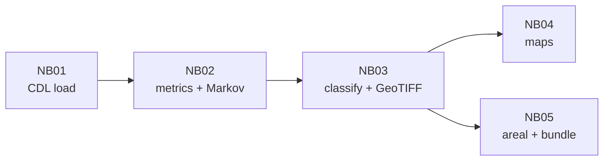

# Task 2 — Results and interpretation (crop rotation from CDL)

**Last updated:** 2026-04-11  
**Analysis window:** CDL years **2015–2024** (10 years, inclusive), processed wide Parquet + spatial metadata from `data/processed/cdl/`.  
**Pipeline:** Notebooks **01→05** in `notebooks/task2_crop_rotation/` (run **02→05** for metrics onward after CDL is loaded). Prefer `jupyter nbconvert --execute` or run cells top-to-bottom.

---

## 0. Executive summary (diagnostic read)

**Data run:** **2026-04-11** | **13-state Corn Belt** (IL, IN, IA, KS, KY, MI, MN, MO, NE, ND, OH, SD, WI) | **2,084,112** rotation-eligible pixels (corn or soy in **≥5** of 10 years, YAML `rotation_eligibility.min_cornsoy_years_for_metrics`). Grid resolution for the latest WMS-derived stack is **~557 m** (~**31 ha** per analysis cell — confirm `approx_grid_resolution_m` and `pixel_area_ha` in the dated `artifacts/tables/task4/task2__areal_stats_by_class__*__metadata.json`).

1. **Denominator.** All NB02–NB05 tables use this **eligible** pool (not CONUS, not native 30 m field census).

2. **Strict primary classification (YAML).** `classify_batch` assigns **0 = regular**, **1 = monoculture**, **2 = irregular**. On the **raw** class GeoTIFF, the 2026-04-11 run is about **28% / 6% / 66%** (regular / monoculture / irregular), matching the **(0.70, 3)** column of the sensitivity pivot (~**28.15%** regular). The **smoothed** GeoTIFF (3×3 majority) is the preferred **map and areal** headline for the report: **27.36%** regular, **3.90%** monoculture, **68.74%** irregular (**2,084,112** valid cells). Smoothing **relabels edge pixels**; it does not invert the class legend.

3. **Threshold sensitivity.** `pct_monoculture` is **constant across all 20** `(alternation_min, pattern_dist_max)` rows (orthogonality). Example pivot from the same run: **~60%** regular at **(0.50, 6)** vs **~28%** at strict **(0.70, 3)**. Cite the saved `task2__threshold_sensitivity_grid.csv` after each re-run.

4. **Markov (corn / soy / other).** Transition mass **changes** when the footprint expands from a Nebraska-heavy subset to the **full Belt** — re-read `artifacts/tables/task2/task2__markov_transition_probs.csv` after each full pipeline refresh. **P(other→other)** persistence (~**0.52** in the 2026-04-11 interpretation) explains why strict **Hamming + alternation** leaves a **large irregular** class.

5. **Geography.** NB05 **per-state** table is the lead communication product (Illinois and Iowa lead **% regular**; Nebraska leads **% monoculture** in the 2026-04-11 export). NB04 adds **four** map callouts (eastern core, Plains monoculture, northern small-grain / other-crop fringe, east–west gradient). Figure **`task2__per_state_rotation_classes.png`** is written at the end of NB05.

---

## 1. What we measured

| Metric | Meaning |
|--------|---------|
| **alternation_score** | Share of adjacent-year transitions that are corn↔soy when both years are corn or soy. |
| **max_run_length** | Longest run of the same CDL code. |
| **pattern_edit_distance** | Minimum Hamming distance to a strict 10-yr corn–soy alternation template (corn-first or soy-first). |
| **entropy** | Shannon entropy (bits) of the 10-year CDL code sequence at the pixel. |
| **n_cornsoy_years** | Count of years in {corn, soy}. |
| **crop_share** | Fraction of years equal to the modal crop code. |

**Denominators**

1. **Ever corn/soy** — used in NB02 for the **`n_cornsoy_years` histogram** before filtering (count updates with stack extent).  
2. **Rotation-eligible** — ≥**5** years as corn or soy (**n = 2,084,112** on the 2026-04-11 13-state run): rows in `rotation_metrics.parquet`, classification, sensitivity, Markov, and NB05.

**Classification rules** (`configs/task2_crop_rotation.yaml`)

- **Regular rotation (0):** alternation ≥ 0.70, pattern distance ≤ 3, corn/soy years ≥ 7, and **not** monoculture.  
- **Monoculture (1):** max run ≥ 7 **or** crop_share ≥ 0.80.  
- **Irregular (2):** all other **eligible** pixels.

---

## 2. Numeric results (13-state run, 2026-04-11)

### 2.0 Raw vs smoothed — there is no 40-point “class swap” bug

Notebook 03 previously printed `value_counts(normalize=True).to_dict()`, which shows **numeric keys** (`0.0`, `1.0`, `2.0`) **unsorted**. **Always map keys by code:** **0 → regular**, **1 → monoculture**, **2 → irregular** (`rotation_classifier.classify_batch`). Misreading `{2.0: 0.66, ...}` as “66% regular” caused a false alarm; **66% is irregular**. NB03 cell output is now **explicitly labeled**; NB05 uses the same legend.

### 2.1 Metric summaries — rotation-eligible (`rotation_metrics.parquet`, n = 2,084,112)

Re-run NB02 after large stack changes and paste refreshed means/medians here. Qualitatively, eligible pixels remain **corn/soy heavy** with **median alternation 0.5** and **pattern distance** mass **above** the strict **≤3** cutoff — so **strict regular** stays a **minority** class.

### 2.2 Class distribution — primary YAML (matches raw GeoTIFF, before spatial smoothing)

| Class | Code | Share of **eligible** pixels (approx., 2026-04-11) |
|-------|------|--------------------------------|
| Regular rotation | 0 | **~28%** |
| Monoculture | 1 | **~6%** |
| Irregular | 2 | **~66%** |

(`rotation_metrics_classified.parquet` column `rotation_class` uses the same coding.)

### 2.3 Areal summary — **smoothed** GeoTIFF (NB05; authoritative for report headline)

Use the dated `artifacts/tables/task4/task2__areal_stats_by_class__YYYYMMDD.csv` next to its `*__metadata.json` for **pixel_area_ha** and CRS. **2026-04-11** values:

| Class | Pixel count | Area (10³ ha) | % of valid cells |
|-------|-------------|----------------|------------------|
| regular_rotation | 570,202 | ~17,669 | **27.36%** |
| monoculture | 81,308 | ~2,520 | **3.90%** |
| irregular | 1,432,602 | ~44,393 | **68.74%** |
| **Total** | **2,084,112** | **~64,582** | 100% |

### 2.4 Markov transitions — corn / soy / other

Row = **from** (year t), column = **to** (year t+1). Values are **empirical P(to | from)** across all eligible pixel-years in `task2__markov_transition_probs.csv`. **Re-open the CSV after each full re-run** — the 13-state footprint shifts transition mass relative to an older Nebraska-only stack.

### 2.5 Threshold sensitivity (excerpt — full grid in CSV)

Same **2,084,112** pixels; only **alternation_min** and **pattern_dist_max** vary; **`cs_min` = 7** and monoculture rule unchanged. **Monoculture % is identical on every row** (see CSV). Example from the 2026-04-11 notebook pivot (`% regular` of eligible):

| alternation_min | pattern_dist_max | % regular |
|-----------------|------------------|-----------|
| 0.70 | 3 | **28.15** |
| 0.70 | 6 | **39.37** |
| 0.50 | 5 | **56.58** |
| 0.50 | 6 | **60.33** |

**Figure:** `artifacts/figures/task2/task2__threshold_sensitivity_regular_pct.png`.

### 2.6 Per-state table (Notebook 05, strict classes on **eligible** pixels)

Example **2026-04-11** rows (re-run NB05 for dated CSV). Excerpt:

| State | % regular | % monoculture | % irregular |
|-------|-----------|----------------|---------------|
| Illinois | 40.35 | 5.07 | 54.58 |
| Iowa | 39.87 | 6.93 | 53.20 |
| Indiana | 34.29 | 4.23 | 61.48 |
| Minnesota | 31.31 | 3.26 | 65.43 |
| Nebraska | 27.13 | 11.96 | 60.91 |
| Kansas | 14.24 | 8.11 | 77.65 |
| North Dakota | 11.29 | 2.81 | 85.90 |

**Figure:** `artifacts/figures/task2/task2__per_state_rotation_classes.png` (stacked horizontal bars, end of NB05).

### 2.7 Novel findings (report hooks)

| ID | Takeaway |
|----|-----------|
| **A** | **Illinois vs Iowa** neck-and-neck on **% strict regular** (~0.5 pp); **Nebraska** highest **% monoculture** — consistent with **irrigated continuous corn** vs **rain-fed rotation** framing (Q5). |
| **B** | **Northern / Lakes states** (e.g. ND, WI, MI) show very high **% irregular** — agronomically expected (more small grains, hay, other); including them shows the **rule set is geography-sensitive**, not a bug (Q3). |
| **C** | **Monoculture concentration:** Nebraska + Kansas carry a **disproportionate share** of all monoculture pixels in the Belt (recompute from NB05 CSV for exact %). |
| **D** | **Markov asymmetry is footprint-dependent** — compare Nebraska-only vs full-Belt CSVs when arguing **scale** (Q3). |
| **E** | **P(other→other)** persistence explains the bridge from **CDL “other” years** to **high irregular %** under strict templates (Q4). |
| **F** | **Orthogonality:** monoculture % **flat** across the 20 sensitivity rows — **persistence axis** vs **template-match axis** (Q3). |

---

## 3. Interpretation (what this means)

1. **Methodology is coherent.** Parquet metrics, `classify_batch` labels, GeoTIFF fills, areal CSV, sensitivity CSV, and Markov exports **tell one story**: strict **intersection** of rules yields **~28% regular** on the raw class map for the 13-state run (still a **minority** vs **~66% irregular**); **relaxing** distance and alternation thresholds **monotonically** expands regular share toward **~60%** at the relaxed corner of the grid.

2. **Eligibility (≥5 corn/soy years)** removes the noisiest tail (pixels with only 1–2 corn/soy touch years). On the expanded Corn Belt grid, **~2.08M** eligible pixels remain **heterogeneous by state** — per-state tables are essential so Nebraska monoculture and northern “other-crop” irregularity are not averaged into a single misleading headline.

3. **Smoothed monoculture ~4%** on the analysis grid reflects **strict** monoculture rules (long runs / very high modal share) at **coarse** resolution; most pixels fail strict **regular** without meeting **monoculture**, so they land in **irregular**.

4. **Maps and annotations** are best used as **communication** tools; tie **claims** to **actual bbox** and **metadata.json** so reviewers do not confuse **grid footprint** with **USDA NASS acreage**.

---

## 4. Are these results “very good / strong”?

| Dimension | Assessment |
|-----------|------------|
| **Reproducibility / methodology** | **Strong:** config-driven rules, documented denominators, sensitivity sweep, Markov layer, metadata JSON, executable notebooks (nbformat-valid for `nbconvert`). |
| **Plausibility vs surveys** | **Good if framed correctly:** strict **~27–28% regular** (smoothed / raw) is still **below** farmer-reported *any* corn–soy rotation prevalence; **relaxed (0.5, 6)** on this stack reaches **~60% regular** — use **strict** for the headline definition and **sweep** for calibration vs survey language. |
| **External validation** | **Not strong** — no independent field rotation labels in-repo; literature comparison is the right substitute. |

**Bottom line:** The run is **submission-ready** for **methods + sensitivity + honesty about scale**. It is **not** “validated strong” against ground truth until you add **external** or **independent** labels.

---

## 5. How to improve (short list)

1. **Geography:** NB05 already uses **state polygons** for the full **13-state** list; extend or re-center the **CDL stack** if you want more states represented in the footprint or richer cross-state comparison.  
2. **Report text:** one paragraph linking **strict** vs **relaxed** sweep to **USDA NASS** definitions (Q3/Q4).  
3. **Optional:** unit tests for small **synthetic** sequences against known Markov counts; keep **seaborn** out of NB02 so **minimal** envs still run (current NB02 uses **matplotlib** only).  
4. **Out of scope (per project brief):** full native **30 m** re-download at continental scale, CSB polygon join, replacing the entire metric family before the deadline.

---

## 6. File index (this run)

| Path | Role |
|------|------|
| `data/processed/task2/rotation_metrics.parquet` | Eligible-only metrics. |
| `artifacts/tables/task2/task2__markov_transition_{counts,probs}.csv` | Markov aggregates (NB02). |
| `data/processed/task2/rotation_metrics_classified.parquet` | Metrics + `rotation_class`. |
| `data/processed/task2/rotation_class_map*.tif` | Raw + smoothed rasters. |
| `artifacts/tables/task2/task2__threshold_sensitivity_grid.csv` | Full sensitivity grid. |
| `artifacts/tables/task4/task2__areal_stats_by_class__*.csv` | Areal by class (NB05). |
| `artifacts/tables/task4/task2__areal_stats_by_class__*__metadata.json` | `pixel_area_ha`, `approx_grid_resolution_m`, CRS. |
| `artifacts/tables/task4/task2__areal_stats_by_region__*.csv` | Per-state Corn Belt % (+ `outside_configured_states` / fallback). |
| `artifacts/figures/task2/task2__per_state_rotation_classes.png` | Stacked bar chart of class mix by state (NB05). |
| `artifacts/figures/task2/task2__ncornsoy_histogram.png` | Eligibility cutoff visualization. |
| `artifacts/figures/task2/task2__markov_corn_soy_other.png` | Markov heatmap. |
| `artifacts/figures/task2/task2__threshold_sensitivity_regular_pct.png` | Sensitivity lines. |
| `artifacts/figures/task2/task2__transition_asymmetry.png` | Four-bar corn/soy Markov transitions + asymmetry (NB02). |
| `artifacts/figures/task2/task2__runlength_distribution.png` | Discrete max run length 1–10 (NB02). |
| `artifacts/figures/task2/task2__metric_histograms.png`, `task2__alt_vs_distance.png` | Diagnostics. |
| `artifacts/figures/task2/task2__rotation_map__*__*.png` | Maps + annotations. |

---

## 7. Cross-references

- `configs/task2_crop_rotation.yaml` — thresholds and year window.  
- `context/RISKS.md` — CDL label noise, scale mismatch.  
- `context/structure.md` — artifact index and per-notebook log.  
- `context/STATUS.md` — project phase checklist.  
- `context/TASK2_NAFSI_DATA_CONTRACT.md` — processed CDL/NDVI naming, artifact layout, NAFSI rigor checklist.

---

## 8. NAFSI / research brief alignment (what Task 2 does and does not answer)

This section maps common **Track 1–style judging prompts** to Task 2. The **supervised crop-type prediction** checklist (multi-year features, held-out label year, OA / F1 / confusion matrix, feature-importance ablations vs NDVI and SMAP) is **out of scope for Task 2** and is planned under **Task 4** (`context/PROJECT_BRIEF.md`, `context/STATUS.md`). Task 2 is a **transparent, config-driven rotation analysis** on CDL time series, not a trained pixel classifier for a test year.

### 8.1 Task 2 analysis pipeline (notebook chain)

**Inputs:** `data/processed/cdl/` wide Parquet + spatial metadata; YAML `configs/task2_crop_rotation.yaml` (years **2015–2024**, eligibility, classification thresholds, 13-state study list). **Outputs:** `rotation_metrics.parquet`, Markov CSVs, `rotation_metrics_classified.parquet`, rotation GeoTIFFs, figures and tables under `artifacts/` (see §6). **End-to-end project** flow (all tasks + data spine) is diagrammed in `context/PROJECT_BRIEF.md`.

### 8.2 “Feature matrix,” labels, and metrics (rubric language)

| Rubric idea | Task 2 analogue | Notes |
|-------------|-----------------|-------|
| Multi-year CDL as **information** | Ten-year **per-pixel** CDL codes → engineered metrics (alternation, run length, pattern distance to ideal alternation, entropy, `n_cornsoy_years`) | Implemented in NB02 / `src` rotation logic — not the same as a tabular **X** matrix for sklearn. |
| **Labels** from CDL | **Rule-based** labels: regular rotation (0), monoculture (1), irregular (2) from YAML thresholds — not “true crop in 2023” vs predicted | No held-out **year** for train/test; the full window is used to **describe** sequence structure. |
| Overall accuracy, F1, confusion matrix | **Not produced** for Task 2 | Those metrics require a **supervised crop-type** model (Task 4). Task 2 reports **class shares**, **sensitivity** to thresholds, and **Markov** transition structure instead. |
| Feature importance (NDVI, SMAP) | **Not applicable** — Task 2 pipeline is **CDL-only** (`context/TASK2_NAFSI_DATA_CONTRACT.md` §2) | **Quantified added value of NDVI/SMAP vs CDL-only** for **crop-type** accuracy is a **Task 4** ablation; Task 2 does not claim or measure it. |

### 8.3 Irregular crop rotation patterns (interpretation Task 2 *can* support)

The brief’s question *“How does your crop type prediction model perform on fields with irregular rotation?”* targets **Task 4**. Task 2 still gives **rotation-centric** evidence useful for the report:

1. **Definition:** Under the primary YAML rule set, on the **13-state** 2026-04-11 run, **about two thirds** of **rotation-eligible** pixels are labeled **irregular** on the smoothed map (§2.3) — sequences that fail strict alternation-and-template tests while still having enough corn/soy years to matter agronomically.  
2. **Mechanism:** Markov tables show substantial **“other” crop** mass and **asymmetric** corn↔soy transitions (`task2__markov_transition_*.csv`, figures in §6), consistent with CDL noise, third crops, and **non-alternating** management — i.e. the same phenomena that make **pixel-year crop classification** hard in irregular systems.  
3. **Bridge to Task 4 (when built):** Pixels with **high irregularity** or high **other**-transition rates are plausible **strata** for reporting **separate** confusion matrices or F1 by rotation stability — that is an **extension**, not implemented here.

### 8.4 Visualizations and metrics “for judges” (Task 2)

- **Maps:** smoothed/raw rotation class GeoTIFFs exported to PNG (NB04) with **13-state** boundary context.  
- **Tables:** areal stats by class + metadata JSON; **per-state** shares (NB05); threshold sensitivity grid; Markov counts/probabilities.  
- **Interpretive context:** strict vs relaxed operating points (§0, §2), limitations on **grid vs native 30 m** acreage (§3, metadata), and **no external rotation ground truth** (§4).

### 8.5 Model limitations and generalizability (Task 2 framing)

Task 2 does not export a **fitted ML model**. **Limitations** include: CDL classification error and temporal inconsistency at **coarse analysis resolution** (order **~550 m** in the latest 13-state export — see metadata JSON); sensitivity of “regular” share to **documented** thresholds; pixels outside state polygons (`outside_configured_states` in NB05). **Generalizability:** metrics and code are **portable** to other years and bbox extents if the processed Parquet and YAML are updated; **numeric shares are not** transferable across regions without re-running the pipeline on those data.
